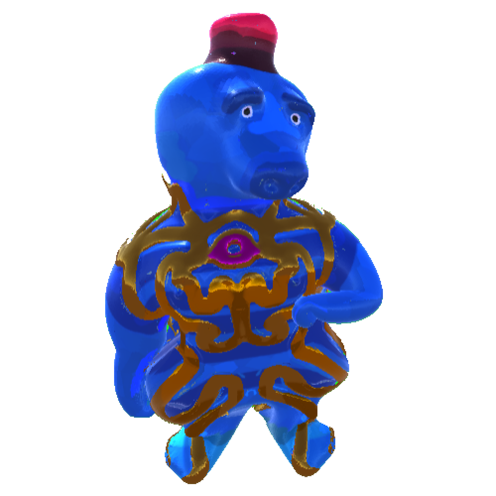
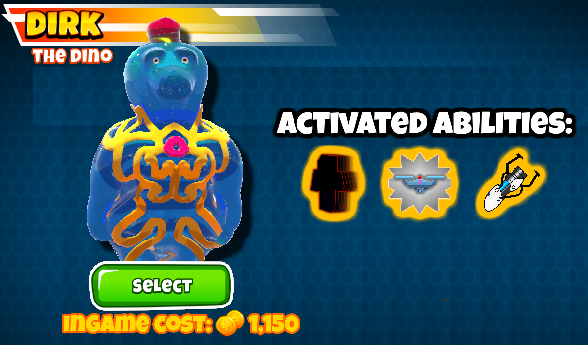

<a href="https://github.com/Bergbauer22/DirkTheDino/releases/latest/download/DirkTheDino.dll">
    
    
<h1 align="center">Dirk, The Doorkeeper</h1>  

</a>

### This Btd6 Mod adds the custom Hero Dirk   

### Levels

1. Dirk's family died 65 million years ago during a long battle....he's taking revenge now
2. Supporting his sons: Every Velociraptor/Tyrannosaurus Rex/Giganotosaurus recieves extra damage and attacks 5% faster
3. Support from his evil friend: For a short time 5 towers can see how strong the dark site is...
4. Dirk boosting his attack skills with energie trinks
5. Godzilla style: He's now able to so use a long range ligntning attack. He's now also targeting invisible bloons
6. Every Tyrannosaurus Rex and Giganotosaurus gains a 20% ability reducten. They also attacks 10% faster
7. Dirk summons a flying Energy Ball
8. Stronger fists push bloons aside
9. Dirk's total transformation clone is now able to transform up to 7 towers. He also doubled their piere
10. Etienne's drone V.2: Launch your drone to terminate bloons in the sky
11. Master developer: Dirk controlls 2 jets with his mind
12. Energie Shock: Every energy based attack is way better! Also he's transforming up to 10 Towers with his transformation ability
13. Portalgun: Switch your position with another Tower of your choice
14. Terminating enginiering skills: Dirk upgrades his drone and adds new weapons to his jets
15. Energy pillars: Press tab to switch your current pillar and control the position with your arrow keys
16. Rise of his power: Every non paragon tower recieves an energie buff(+15% Attack Speed)
17. Overpowering himself: Energie can now spring to other bloons and his 3 energie balls combines into 1 Mega-Energie-Ball
18. Dirkerine: Dirk optained a extream healing factor which makes him regenerate lives if you are under 1000 hearths
19. Dirk turns into god mode and improves his energie with the power of lightnings
20. Over the top: Dirk shares his power even with paragons

Thanks to the english Youtuber Tewtiy for making the voicelines

<h1 aling="left"></h1>

